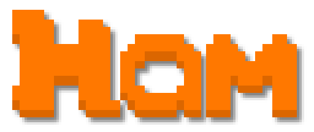

<h1 align="center">

 
 
The Hamsmith Development Environment
 
 
</h1>

> **NOTE** This is a work in progress and currently has a tumoltuous development cycle with many things changing and breaking constantly. Use at your own peril.

 

This project is intended as a general purpose environment for developing games and other interactive applications.

 
 

<h2 align="center">
Featuring
 
 
</h2>

- Ham Runtime (`libham`)
- Ham Language (`hamc`, `hami`)
- Ham World Engine (`ham-engine-client`, `ham-engine-server` and `libham-engine`)

 
 

<h2 align="center">
Ham Runtime
 
 
</h2>

> LGPLv3+

The Ham runtime is the backbone of all other components in the project.

 
 

<h2 align="center">
Ham Language
 
 
</h2>

> GPLv3+

The Ham Language is currently a POC and should not be used.

 
 

<h2 align="center">
Ham World Engine
 
 
</h2>

> GPLv3+

A creative environment for developing games and immersive experiences.

 
 
